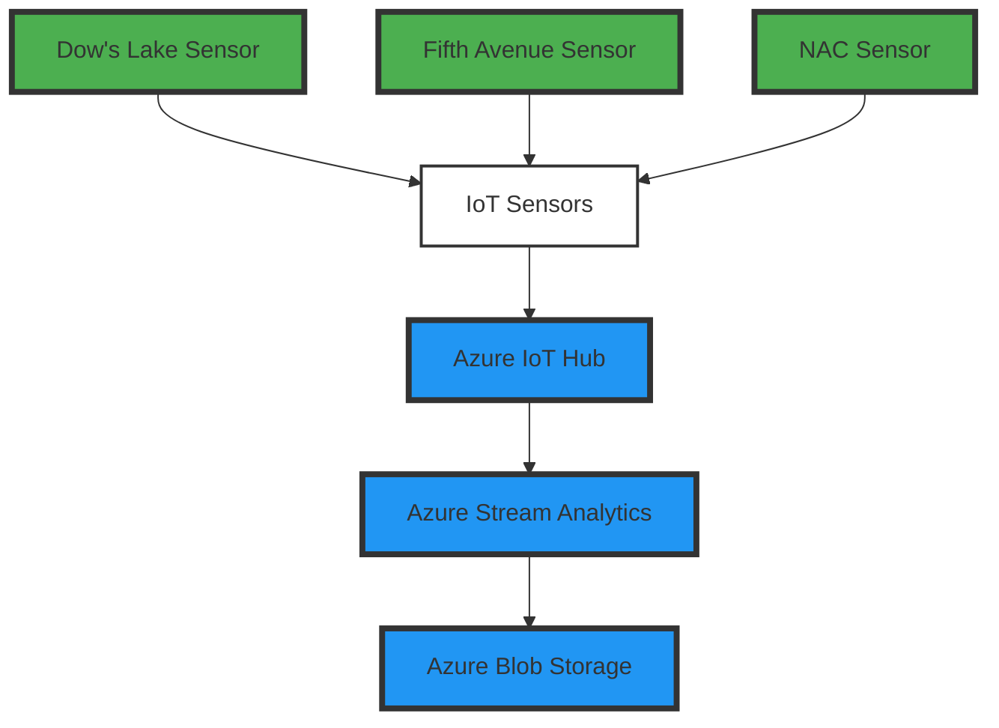

# Rideau Canal Skateway Real-Time Monitoring System

## Group Members
1. **Jatin Hooda**
2. **Devgiri Gosai**

## Scenario Description
The **Rideau Canal Skateway**, a historic and world-renowned attraction in Ottawa, needs constant monitoring to ensure skater safety. The team was hired by the National Capital Commission (NCC) to build a real-time data streaming system to monitor ice conditions and weather factors along the canal. The system will simulate IoT sensors, process incoming sensor data, and store the results for further analysis.

## System Architecture
The system consists of several key components:
1. **IoT Sensors**: Simulate sensor data at key locations along the Rideau Canal.
2. **Azure IoT Hub**: Ingests the sensor data in real time.
3. **Azure Stream Analytics**: Processes the data in real time to detect unsafe conditions.
4. **Azure Blob Storage**: Stores the processed data for future analysis.




## Implementation Details

### IoT Sensor Simulation
The IoT sensor simulation is a Python script that generates and sends sensor data to Azure IoT Hub. The data includes the following fields:
- **Temperature**: External temperature in Celsius.
- **Ice Thickness**: Ice thickness in centimeters.
- **Timestamp**: Time of data generation.

The data is generated at regular intervals and pushed to Azure IoT Hub for real-time processing.

### Azure IoT Hub Configuration
The Azure IoT Hub is set up to ingest real-time data from the simulated sensors. The device connection string and endpoint configuration ensure that the data is received and routed appropriately.

### Azure Stream Analytics Job
The Stream Analytics job aggregates data from the IoT Hub, including:
- Average ice thickness over a 5-minute window.
- Maximum snow accumulation in that window.

SQL queries are used to aggregate and process this data in real time.

### Azure Blob Storage
Processed data is stored in Azure Blob Storage in JSON or CSV format. Data is organized into folders for each sensor location, and the filenames include timestamps for easy tracking.

## Usage Instructions

### Running the IoT Sensor Simulation
1. Clone the repository to your local machine.
2. Install required Python libraries by running:
    ```bash
    pip install azure-iot-device
    ```
3. Replace the `CONNECTION_STRING` in the Python script with your own IoT Hub connection string.
4. Run the simulation script:
    ```bash
    python sensor_simulation.py
    ```

### Configuring Azure Services
1. Set up an **IoT Hub** in the Azure portal and configure the device connection string.
2. Create a **Stream Analytics Job** to process data from the IoT Hub.
3. Set up **Blob Storage** to store the processed data.

### Accessing Stored Data
1. Navigate to your Azure Blob Storage account.
2. Locate the container where processed data is stored.
3. Download and analyze the data in JSON or CSV format.

## Results
Key findings include:
- Average ice thickness: [Sample Data]
- Maximum snow accumulation: [Sample Data]

## Reflection
During implementation, we faced challenges in setting up the Azure IoT Hub and configuring the Stream Analytics queries. However, with clear documentation from Azure and iterative testing, we were able to resolve these issues.


