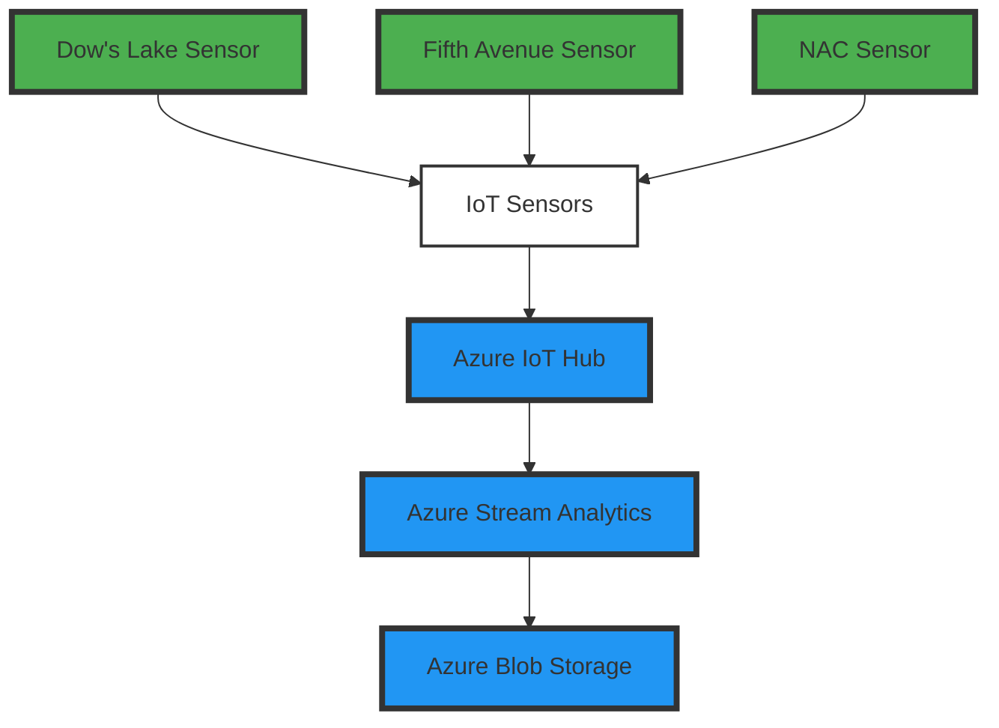

# Rideau Canal Skateway Real-Time Monitoring System

## Group Members
1. **Jatin Hooda**  
2. **Devgiri Gosai**

---

## Scenario Description
The **Rideau Canal Skateway**, a historic and world-renowned attraction in Ottawa, needs constant monitoring to ensure skater safety. The National Capital Commission (NCC) hired our team to build a real-time monitoring system to:  

- Simulate IoT sensors at three key locations along the canal: **Dow's Lake**, **Fifth Avenue**, and **NAC**.  
- Process incoming data to detect unsafe conditions in real time.  
- Store processed data in Azure Blob Storage for future analysis.  

---

## System Architecture

### Architecture Overview
The system consists of four main components:  

1. **IoT Sensors**: Simulate ice conditions and weather data from three locations.  
2. **Azure IoT Hub**: Ingest sensor data in real time.  
3. **Azure Stream Analytics**: Process data to calculate averages and detect unsafe conditions.  
4. **Azure Blob Storage**: Store processed data for analysis.  

### Data Flow Diagram


---

## Implementation Details

### IoT Sensor Simulation
A Python script simulates sensor data for three locations every 10 seconds. Each sensor generates the following fields:  

- **Location**: Dow's Lake, Fifth Avenue, or NAC.  
- **Ice Thickness (cm)**: Key safety metric.  
- **Surface Temperature (°C)**: Indicates ice melting risks.  
- **Snow Accumulation (cm)**: Affects ice usability.  
- **External Temperature (°C)**: Adds weather context.  
- **Timestamp**: UTC timestamp for each reading.  

#### Example JSON Payload
```json
{
  "location": "Dow's Lake",
  "iceThickness": 27,
  "surfaceTemperature": -1,
  "snowAccumulation": 8,
  "externalTemperature": -4,
  "timestamp": "2024-11-23T12:00:00Z"
}
```

### Azure IoT Hub Configuration
The Azure IoT Hub is configured to ingest real-time data from all three sensors. A single IoT Hub device connection string is used for simplicity, and routing is configured to send data directly to Stream Analytics.  

### Azure Stream Analytics Job
The Stream Analytics job processes data in real time with the following logic:  

- Aggregate data from each location over a **5-minute window**:  
  - **Average Ice Thickness**.  
  - **Maximum Snow Accumulation**.  

#### Example SQL Query
```sql
SELECT 
    location,
    AVG(iceThickness) AS avgIceThickness,
    MAX(snowAccumulation) AS maxSnowAccumulation,
    System.Timestamp AS windowEndTime
FROM IoTInput
GROUP BY 
    location, 
    TumblingWindow(minute, 5)
```

### Azure Blob Storage
Processed data is stored in **JSON** format in Azure Blob Storage. The data is organized by sensor location, with filenames including timestamps for easy tracking.  

#### Folder Structure Example
```
blob-container/
├── Dow's Lake/
│   ├── 2024-11-23T12:00:00Z.json
│   ├── 2024-11-23T12:05:00Z.json
├── Fifth Avenue/
│   ├── 2024-11-23T12:00:00Z.json
│   ├── 2024-11-23T12:05:00Z.json
├── NAC/
    ├── 2024-11-23T12:00:00Z.json
    ├── 2024-11-23T12:05:00Z.json
```

---

## Usage Instructions

### Running the IoT Sensor Simulation
1. Clone the repository to your local machine.  
2. Install required Python libraries:  
    ```bash
    pip install azure-iot-device
    ```  
3. Replace the `CONNECTION_STRING` in the Python script with your IoT Hub connection string.  
4. Run the simulation script:  
    ```bash
    python sensor_simulation.py
    ```  

### Configuring Azure Services
1. Set up an **Azure IoT Hub** and configure the device connection string.  
2. Create an **Azure Stream Analytics Job** to process the IoT data.  
3. Set up an **Azure Blob Storage** container for output storage.  

### Accessing Stored Data
1. Navigate to your Azure Blob Storage account.  
2. Locate the container with processed data.  
3. Download JSON files for analysis.  

---

## Results

### Sample Processed Data
| Location        | Avg Ice Thickness (cm) | Max Snow Accumulation (cm) | Timestamp              |
|-----------------|-------------------------|----------------------------|------------------------|
| Dow's Lake      | 37.56                  | 47.91                      | 2024-11-23T12:05:00Z   |
| Fifth Avenue    | 33.45                  | 40.12                      | 2024-11-23T12:05:00Z   |
| NAC             | 35.88                  | 45.67                      | 2024-11-23T12:05:00Z   |

---

## Reflection
During implementation, we faced challenges in:  
1. Configuring Azure IoT Hub routing for multiple sensors.  
2. Writing SQL queries for location-specific data aggregation.  

These issues were resolved using Azure documentation and iterative testing. This project provided valuable experience in building scalable IoT solutions.
